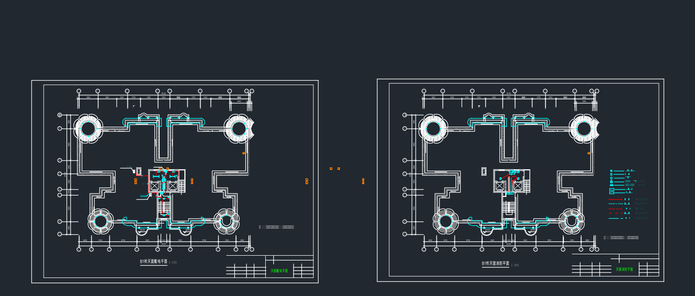
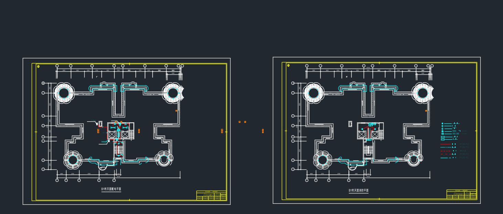
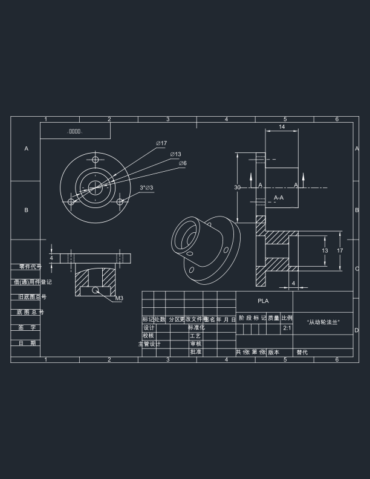
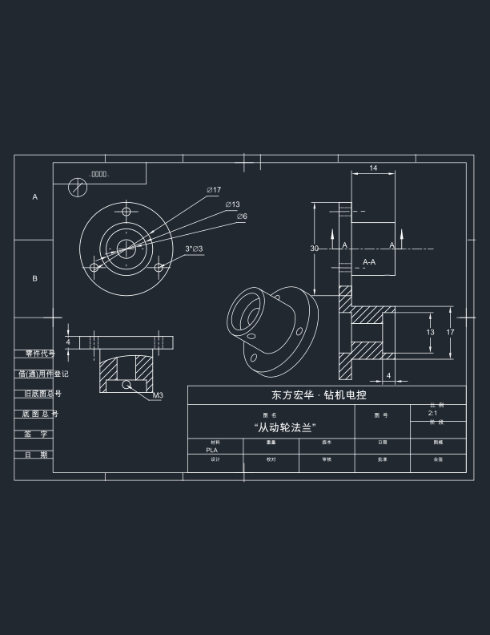
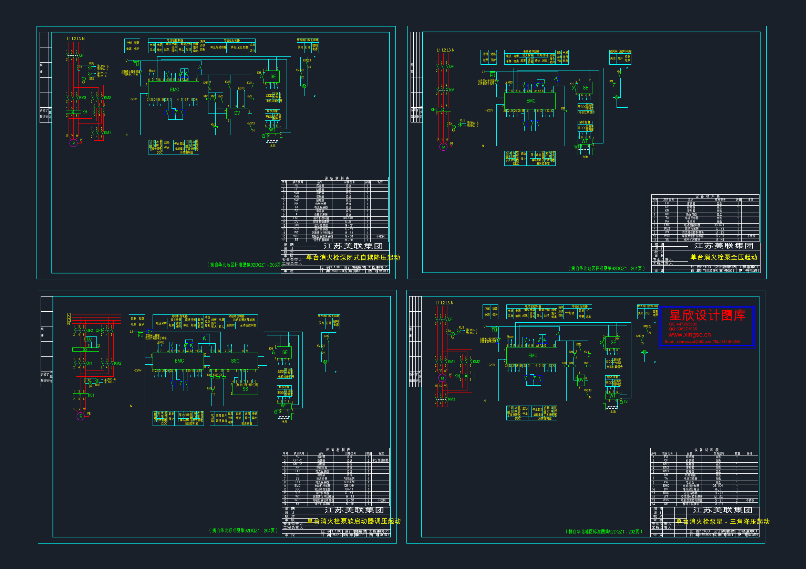
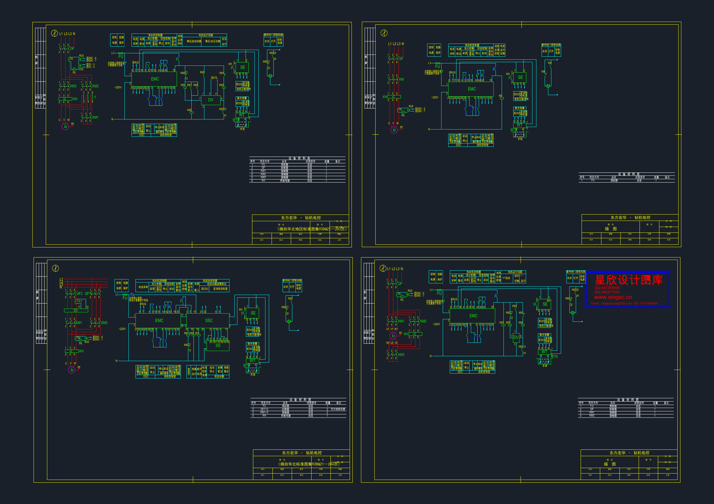
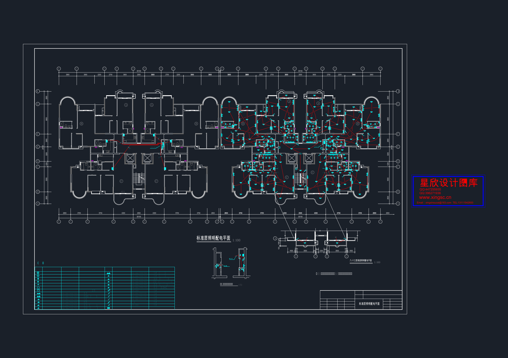
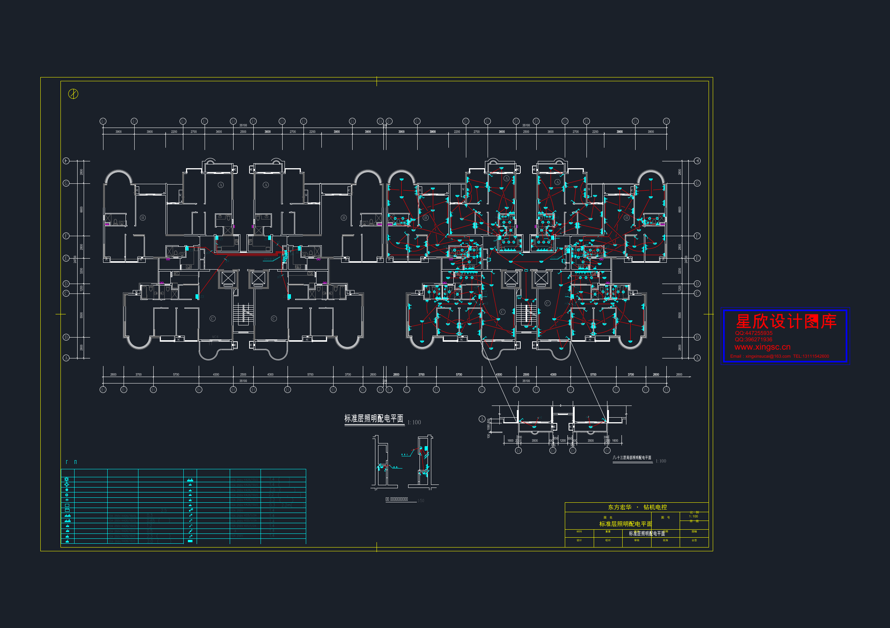
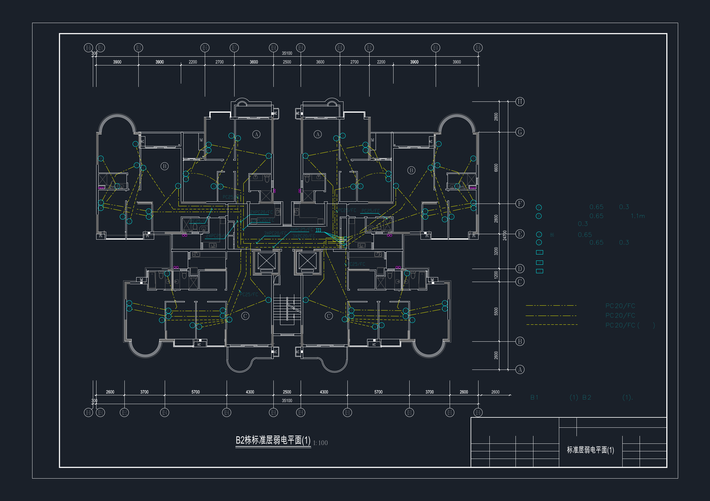
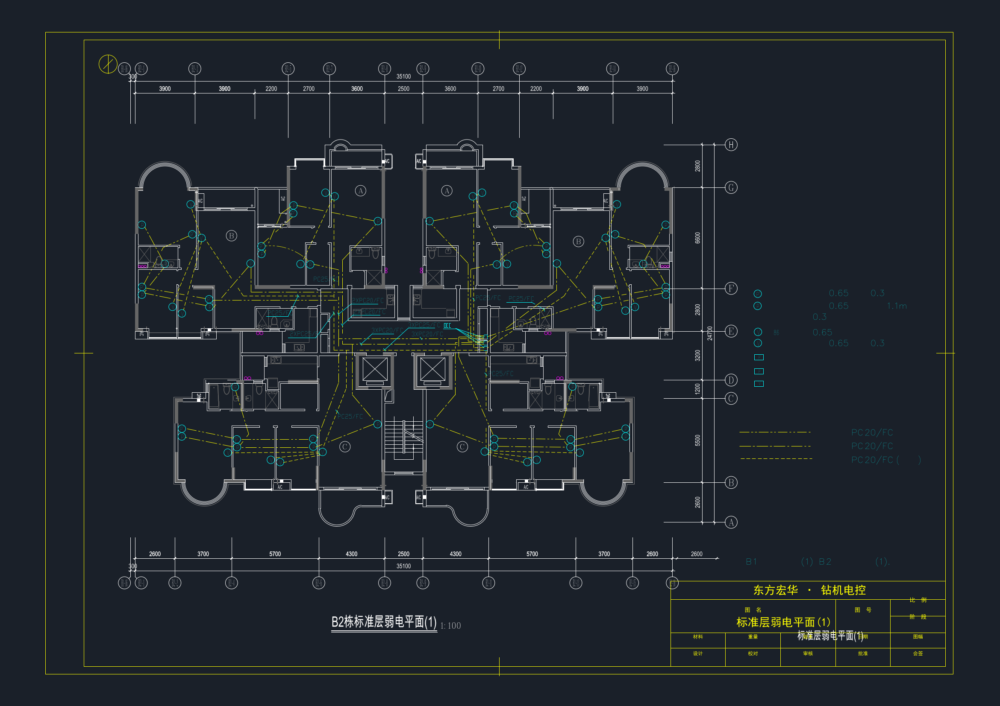

# CAD 电路图图框批量置换工具

把历史 CAD 电路图纸上的旧图框，自动换成你们公司的标准图框，并**无损迁移**旧图框里的字段
（图名 / 图号 / 比例 / 阶段 / 日期 / 设计人 …）。支持批量处理，公司图框**随时会变**——换模板重跑即可，代码零改动。

**双引擎**：
- **策略一 · ezdxf 离线核心**——纯 [ezdxf](https://ezdxf.readthedocs.io/) 实现，不依赖 AutoCAD，跨平台，输出 DXF。
- **策略二 · AutoCAD COM 直接处理**——本机装了 AutoCAD 时，用 ezdxf 做「检测 + 字段计划」，
  实际删框 / 插框 / 回填 / 保存全部交给 AutoCAD COM 在原文件副本上完成，输出**真正被 AutoCAD 认可的 DWG**，
  彻底绕开 ezdxf `saveas` 后 AutoCAD 打不开的兼容性问题。

> 实测：微信发来的「打散」类真实图纸（0 个 INSERT 块标题栏、含中文 SHX 字体）走策略二，
> 住宅楼电气整套 11 张 DWG **11/11 全部成功**插入公司图框，旧框残线 **11/11 = 0**。

---

## 🚀 案例与效果（先看这里）

本仓库自带 **12 套案例**（10 套带前后对比渲染 + 2 套逻辑 / 负样本验证），覆盖真实机械图纸、电气系统图、储能图纸、装配体、设计院标准图、合成异常样本、多图框逐框替换、真实图纸拼接的多图框端到端验证，以及真实住宅楼电气设计方案（11 张 DWG）和给煤机控制原理图。

因为 GitHub README 对大量高清图片的表格排版支持有限，**完整前后对比请直接打开下面几个自包含 HTML 报告**（浏览器直接看，含高清 PNG）：

- 📊 **[cases/report.html](cases/report.html)** —— 完整效果对比报告（链接图，含各案例前后对比 + 使用说明 + 修复记录）
- 📦 **[cases/showcase.html](cases/showcase.html)** —— 单文件离线版，图片全部内嵌（约 10 MB），可直接下载发微信 / 邮件
- 🏠 **[cases/index.html](cases/index.html)** —— 案例导航首页
- 🖼️ **[gallery.html](gallery.html)** —— 一次性看全部 12 案例、122 张渲染（原图 / 模板 / 换框后 对照）
- 🧪 **[src_test_out/exe_test.html](src_test_out/exe_test.html)** —— 源码 `run_skill.py` 实测 9 张 SolidWorks 图纸前后对比
- 🧪 **[test_other/test_other.html](test_other/test_other.html)** —— 其他场景 20 张前后对比

### 效果速览

<p align="center"><b>住宅楼·天面（策略二 AutoCAD COM，真实 DWG）</b></p>

| 替换前 | 替换后 |
|---|---|
|  |  |

<p align="center"><b>SolidWorks 导出零件图（策略一 ezdxf 离线）</b></p>

| 替换前 | 替换后 |
|---|---|
|  |  |

### 精选案例（真实 DWG · 策略二 AutoCAD COM 端到端核验）

从真实 DWG 端到端置换核验中精选 3 例——主标题、图框水印与主图内容清晰可读，旧图框残线全部清零。

<p align="center"><b>标准设计院 · 消火栓泵（92DZ1，2×2 多图框逐框替换）</b></p>

| 替换前 | 替换后 |
|---|---|
|  |  |

<p align="center"><b>住宅楼 · 强电平面（标准层照明配电）</b></p>

| 替换前 | 替换后 |
|---|---|
|  |  |

<p align="center"><b>住宅楼 · 弱电平面（标准层）</b></p>

| 替换前 | 替换后 |
|---|---|
|  |  |

> 完整住宅楼 11 张前后对比见 `assets/thumbnails/case10_*.png`；多图框与标准设计院 92DZ1 详见 `cases/05_standard_dwg/`。

## 🧪 端到端实测报告（真实数据 · 点开看前后对比）

两份自包含 HTML 报告，将**真实输入 / 输出 DXF** 用 ezdxf 渲染成 SVG 内联，浏览器直接看「替换前 → 替换后」；所有数字、字段均来自真实运行，未做任何虚构。

### 一、源码实测（9 张 SolidWorks「打散」图纸）

源码 `run_skill.py` 真跑 9 张微信工程图，验证「从源码到成品」全链路：

- **结果**：9 / 9 成功（`status=ok`），共删除 **746** 个旧图框相关实体；旧图框属性（图名 / 材料 / 比例 / 图号 / 重量 …）回填至新标题栏。
- **按幅面自动选模板**：A4 × 6 + 非标 C429X297 × 3（400×277 真漂移非标，不被误判成标准幅面）。
- **提取到的真实字段示例**：`TITLE=从动轮法兰 / 前叉 / 圆柱齿轮`、`MATERIAL=PLA / ABS / 亚克力`、`SCALE=2:1 / 1:5`、`WEIGHT=0.681`。
- 👉 [源码实测报告（src_test_out/exe_test.html）](src_test_out/exe_test.html)

### 二、其他场景测试（20 张，自动选模板 + 标题栏残线修复）

覆盖 case 01/03/06/07/08，验证两处修复在真实图纸上的端到端效果：

- **结果**：20 / 20 张标题栏残线 = **0**（清洁率 100%）。
- **自动按幅面选模板全覆盖**：A1 × 9（ESS 储能大图幅）、A2V × 2（竖版）、A3 × 2、A4 × 6，加长非标 C429X297 × 3 / C867X420 × 1 / C423X210 × 1（多图框图纸按逐框计）。
- **两处修复**：① 大图幅误判（约 A1 框原被误判 A3@1:2，现优先按 1:1 实尺 → 正确选 A1）；② 标题栏残线（旧长格线原因略超 0.30×maxdim 被当尺寸线保留，现仅「长且大幅越出标题栏」的尺寸线才保留）。
- 👉 [test_other/test_other.html](test_other/test_other.html)

---

## 架构：双策略管线（我们修改后的一些逻辑）

```
run_skill.py  (通用主入口，--dwg 控制是否走 AutoCAD COM)
   │
   ├─ 检测：lib/finder.py
   │     • find_titleblocks     块式标题栏（块名 + ATTDEF 词表）
   │     • detect_frames         线框检测（轴对齐直线聚合出闭合矩形外框）
   │     • detect_frames_hierarchical  多图框层级检测（含全局占比护栏）
   │     • extract_frame_fields  真实图名/图号提取（按字号最大 + 标题栏标签，排除注记/电缆/房间号）
   │
   ├─ 幅面推断：lib/sheet.py  ── 旧框图形尺寸 → 先猜出图比例(1:100…) → 再匹配 A0~A4 / 加长幅面
   │
   ├─ 模板重定向：lib/frame_gen.py  ── 按检出旧框真实比例即时重定向 HH_FRAME 模板（锚定拉伸），非 √2/竖版也能严丝合缝
   │
   ├─ 策略一（无 --dwg）：lib/raw_replace.py + lib/block_replace.py 经 ezdxf 直接读写 DXF
   │
   └─ 策略二（--dwg，本机有 AutoCAD）：lib/acad_pipeline.py + lib/acad_com.py
         用 ezdxf 做 plan，AutoCAD COM 在原文件副本上：删旧框/标题栏 → 插模板 DWG(双插法) → 回填 14 属性 → SaveAs .dwg
```

### 幅面推断与模板重定向（新增模块，解决「比例失真」）

- **`lib/sheet.py`**：旧代码把「图形单位下的框尺寸」直接和「毫米制 A 幅面表」比大小，导致 1:100 出图的 A1（84100×59400 单位）被误判成 A0。
  正确做法：先由「外框到内框的 GB/T 14689 标准边距」反推出图比例分母（如 100），再匹配标准幅面；
  匹配不上时返回 `exact=False` 的自定义幅面（保留旧框精确长宽比，短边归一到最近标准短边）。
- **`lib/frame_gen.py`**：旧方案只有 A0~A4 五个 √2 模板，遇非 √2 / 竖版图就套不住旧框（内容溢出或跑到框外）。
  现按检出旧框真实比例**即时重定向模板**：整幅矩形保留留边拉伸、标题栏刚性右下锚定、边缘小元素锚定到对应边。
  自校验：从 A4 重定向出的 A1 与仓库真实 A1 模板逐点一致（`tests/test_frame_gen.py`）。

### 策略二关键实现要点（AutoCAD COM 直接处理）

- `acad_pipeline.process_file` 直接 `Documents.Open` 源文件（扩展名与内容一致，AutoCAD 可识别），编辑后 `SaveAs(dst, 12)` 写二进制 DWG，**不改动源文件**。
- `InsertBlock` 不能直接吃 DXF，模板须先经 `doc.SaveAs(_HH_FRAME_Ax.dwg, 12)`（acNative）转成 DWG；插框用「双插法」拿到 14 个可回填属性，规避同名块自参照。
- 删框双保险：`del_frame_edges`（按图层删外框）+ `del_frame_layer_inside`（删图框层上完全落在旧框内的全部残线），杜绝新框压旧线。
- `_get_acad` 优先 `GetActiveObject`，失败则 `Dispatch` 自动启动 AutoCAD，`--dwg` 开箱即用。

---

## 0. 准备

- **核心库 / CLI**：Python 3.13+（已装 ezdxf 1.4.x）。本机 managed venv 即可：
  ```
  C:/Users/86308/.workbuddy/binaries/python/envs/default/Scripts/python.exe
  ```
- **GUI 界面**：用**系统 Python 3.14** 运行 `python gui_app.py`（`C:\Python314\python.exe`）——managed 3.13 venv 未带 tcl/tk，`import tkinter` 会失败。
- 依赖安装：`pip install -r requirements.txt`（装包请用官方源 `-i https://pypi.org/simple`，清华源个别包缺失）。

## 1. 目录结构

```
cad-frame-replacement/
├── run_skill.py            # 通用主入口：template + 旧图纸 → 新图纸（--dwg 切换 AutoCAD COM 策略二）
├── run_real.py             # 案例一：SolidWorks 导出零件图批量置换（策略一）
├── run_cng.py              # 案例二：CNG 电气系统图（策略一）
├── run_cng_acad.py         # 案例二（策略二早期形态，现已并入 run_skill --dwg）
├── run_ess.py              # 案例三：储能 ESS 图纸（策略一）
├── run_asm.py              # 案例四：无图框装配体（策略二）
├── run_synth.py            # 案例六：合成异常样本验证
├── run_multiframe.py       # 案例七：多图框逐框替换
├── run_real_mf.py          # 案例八：真实多图框（4×A1 拼接）端到端验证
├── run_residential.py      # 案例十：住宅楼电气 11 张 DWG（策略二）
├── gen_synth.py            # 生成合成异常样本图纸
├── gen_mf_samples.py       # 生成多图框测试样本
├── gen_real_mf.py          # 案例八：把 4 张真实 A1 图纸拼成 2×2 多图框 DXF
├── make_tpl_dwgs*.py       # 生成 HH 公司图框模板 / WBLOCK 转 DWG
├── gui_app.py              # 图文界面主程序（复用 run_skill.main，核心逻辑零改动）
├── lib/                    # 核心库（双策略管线）
│   ├── concepts.py         # 中英文/简写字段名 → 统一“概念”中间层
│   ├── template_learn.py   # 模板自动学习（块 ATTDEF / 打散 <图名> 占位符）
│   ├── finder.py           # 旧版图框检测（块式 / 线框 / 多图框层级）+ extract_frame_fields（真实图名提取）
│   ├── extract.py          # 旧图属性提取（ATTRIB / TEXT 键值对）
│   ├── mapper.py           # 概念级字段映射
│   ├── block_replace.py    # 策略一：删旧框 + 插入新框 + 回填字段
│   ├── raw_replace.py      # 策略一：打散图框（无块）删外框/标题栏/边缘区号 + 整图幅插模板
│   ├── sheet.py            # 【新增】幅面推断：图形尺寸 → 出图比例 → 标准/自定义幅面
│   ├── frame_gen.py        # 【新增】模板重定向：按旧框真实比例即时生成任意幅面模板
│   ├── acad.py             # DWG <-> DXF 转换器探测（ODA / LibreCAD）
│   ├── acad_com.py         # 【策略二】AutoCAD COM 助手（采集实体 / 删框 / 插框 / del_frame_layer_inside）
│   ├── acad_pipeline.py    # 【策略二】通用 COM 流水线：plan → 删框/插框/回填/SaveAs .dwg
│   └── logbook.py          # 执行日志 + run_report.json
├── templates/              # HH 公司图框模板 A0-A4（WBLOCK 出的 .dwg 由管线临时生成）
├── cases/                  # 12 套案例（输入/输出/对比图/报告/verify）
│   ├── report.html         # 完整对比报告（链接图）
│   ├── showcase.html       # 单文件内嵌图片版（约 10 MB）
│   ├── index.html          # 案例导航页
│   ├── gallery.html        # 全部 12 案例渲染图集（原图/模板/换框后，本地静态服务查看）
│   ├── 01_SW_parts/        # 真实机械零件图（9 张，策略一）
│   ├── 02_CNG_electrical/  # CNG 电气系统图（策略二）
│   ├── 03_ESS_cad/         # 储能 ESS 图纸（4 张，策略一）
│   ├── 04_assembly/        # 无图框装配体（策略二）
│   ├── 05_standard_dwg/    # 标准设计院图纸（92DZ1 消火栓泵，2×2 多图框，策略二）
│   ├── 06_synth/           # 合成异常样本
│   ├── 07_multiframe/      # 多图框逐框替换
│   ├── 08_real_mf/         # 真实多图框（4×A1 拼接）端到端验证
│   ├── 09_kuidian_electrical/  # 馈电-电气原理图（A4 竖版，策略二）
│   ├── 10_residential_electrical/  # 住宅楼电气设计方案（11 张 DWG，策略二，#99/#103 修复）
│   ├── 11_geimei_control/  # 给煤机控制原理图（边框 less，逻辑验证/检测器加固）
│   └── 12_detect_negative/ # 检测负样本（std_A3 / S7-1200，已知局限归档）
├── tests/                  # 64 个用例（62 passed / 2 skipped）
├── samples/  output/       # 运行期生成（不入库）：放待处理旧图 / 生成成品
└── requirements.txt  requirements-dev.txt  pytest.ini  MANUAL.md  SKILL.md
```

## 2. 快速开始（跑案例）

```bash
# 1) 安装依赖
pip install -r requirements.txt -i https://pypi.org/simple

# 2) 跑一个案例（策略一输出 DXF）
python run_real.py      # 案例一：9 张 SW 零件图
python run_cng.py       # 案例二：CNG 电气系统图（DXF）
python run_ess.py       # 案例三：ESS 储能
python run_asm.py       # 案例四：无图框装配体（COM 转 DXF）
python run_synth.py     # 案例六：合成异常样本
python run_multiframe.py # 案例七：多图框逐框替换
python gen_real_mf.py && python run_real_mf.py  # 案例八：真实 4×A1 拼接多图框

# 策略二（AutoCAD COM 直接输出 DWG）：案例五/九/十 用通用入口 --dwg
python run_skill.py --template templates/HH_FRAME_A3.dxf --dwg --fit max  cases/05_standard_dwg/inputs/*.dwg
python run_skill.py --template templates/HH_FRAME_A4.dxf --dwg --fit max  cases/09_kuidian_electrical/inputs/*.dwg
python run_residential.py   # 案例十：住宅楼电气 11 张 DWG（封装了上面的调用）

# 通用入口也能直接处理多图框：auto 自动判断单/多框，multi 强制逐框替换
python run_skill.py --template templates/HH_FRAME_A1.dxf --mode auto  cases/07_multiframe/inputs/*.dxf
python run_skill.py --template templates/HH_FRAME_A1.dxf --mode multi  cases/08_real_mf/inputs/*.dxf

# 3) 看报告（浏览器打开）
cases/report.html
```

## 3. 跑自己的图纸

```bash
# 默认：输出 DXF（策略一，核心稳定）
python run_skill.py --template templates/公司图框.dxf  samples/*.dxf

# 多张混批
python run_skill.py --template templates/公司图框.dxf  samples/old1.dxf samples/old2.dxf

# 需要 DWG 输入输出（本机有 AutoCAD 时走策略二，否则依赖 ODA / LibreCAD 转换器）
python run_skill.py --template templates/公司图框.dxf --dwg  samples/*.dwg

# 只检测标题栏，生成 detection.json（不改图）
python run_skill.py --template templates/公司图框.dxf --detect-only  samples/*.dxf

# 只提取+映射，预览迁移结果（不改图）
python run_skill.py --template templates/公司图框.dxf --dry-run  samples/*.dxf
```

常用参数：
| 参数 | 说明 |
|---|---|
| `--template` | 公司图框模板（必填） |
| `--out` | 输出目录（默认 `output/`） |
| `--suffix` | 输出文件后缀（默认 `_HH`） |
| `--dwg` | 输出 DWG（本机有 AutoCAD 走策略二；否则需 ODA / LibreCAD 转换器） |
| `--fit` | 新框缩放：`min` 保比例居中(默认) / `max` 满填 / `width` / `height` |
| `--margin` | 打散图框删除边距 |
| `--override` | 字段映射覆盖，如 `{"TITLE":"OLD_TITLE"}` |
| `--mode` | 单框/多图框判定：`auto` 自动(默认，≥2 框走逐框替换) / `single` 强制整图幅一张框 / `multi` 强制逐框替换 |
| `--detect-only` / `--dry-run` | 分阶段调试 |

## 4. 公司图框“随时会变”怎么办

**什么都不用改代码**，只要：
1. 用新版公司图框覆盖 `templates/` 下的模板文件（块名、字段措辞、字段增减都行）；
2. 重新跑一次 `run_skill.py`。

模板学习是**全自动**的：块模板读 ATTDEF，打散模板读 `<图名>` 占位符；字段按“概念”对齐
（图名↔TITLE、图号↔DWG_NO …），中英文/简写都能对上。新模板多出来的字段，旧图没有对应来源的会自动留空。

## 5. 输出与校验

- 每个源图生成 `原名_HH.dxf`（或 `--dwg` 时 `原名_HH.dwg`），原文件永不覆盖。
- `output/Execution_Log.csv`：逐张执行记录（检测数 / 删除实体 / 回填字段 / 状态）。
- `output/run_report.json`：完整报告，含每张图的字段提取与映射明细，便于核对。
- 案例十这类「打散真实图纸」额外用 `verify/verify_shallow.json`（ezdxf `bbox.extents` 统计 HH_FRAME 块数与框内残线）做浅层核验，11/11 残留 = 0。

## 6. 已知约束

- **DWG 输入**：策略二下本机有 AutoCAD 时直接 `Documents.Open` 读 DWG；无 AutoCAD 时，DWG 输入会先转 DXF 再处理（依赖 ODA File Converter / LibreCAD），输出也只给 DXF。
- **打散旧图框（无块）**：靠「关键词 + 附近表格线」吸附定位，复杂图纸建议先用 `--detect-only` 人工确认区域；块图框识别最稳。
- **缩放策略**：默认 `min`（保比例、不拉伸变形、居中）。若觉得“图框偏小有留白”，用 `--fit max` 满填（横向可能略溢出进上方电路，约 2% 形变，可接受）。**非 √2 / 竖版图**现已由 `lib/sheet.py` + `lib/frame_gen.py` 即时重定向模板解决，不再等比套不住。
- **多图框误检治理**：电气图里大量端子 / 符号 / 表格单元都是闭合矩形，早期检测会把它们全当成“图框”（CNG 电气系统图曾误检 61 个）。现用“面积占比下限(0.15) + 双线去重”两级过滤压到真实框数（CNG 实测 4 个）。注意**不能**用“长宽比接近 √2”筛——加长图幅在电气图里很常见（CNG 左侧三个真图框长宽比就是 2.00），按标准图幅比例会误杀真框。
- **边框 less / 全块化图纸**：案例十一（给煤机）正确判定「无有效图框、不改图」；案例十二（std_A3 分段边框、S7-1200 全块化）属当前检测器**已知局限 / 负样本**，线框检测器对「分段短直线边框」需跨 y 键容差合并、对「块内图框」需新增递归展开能力，后续版本增强。
- 双线图框（外框 + 内框两条矩形）会被去重为外框，替换时一并清理内框残线，避免新框上压一圈旧线。
- 若你手上有天然多图框的图纸，建议先 `--detect-only` 看一下识别出的框数是否符合预期。

---

## 7. 本分发版包含内容

- **核心**：`lib/`（图框检测、幅面推断、模板重定向、字段提取映射、替换、模板学习；策略一 ezdxf + 策略二 AutoCAD COM）
- **模板**：`templates/`（HH 公司图框 A0-A4）
- **12 套案例**：`cases/01_SW_parts` … `cases/12_detect_negative`，每套含输入图纸、输出成品、前后对比 PNG（11/12 为逻辑/负样本验证，无渲染图）
- **报告**：`cases/report.html`（链接图）、`cases/showcase.html`（内嵌图单文件，约 10 MB）、`cases/index.html`、`gallery.html`（全案例渲染图集，本地静态服务查看）
- **入口脚本**：全部 `run_*.py` / `gen_*.py` / `make_*.py` / `gui_app.py`
- **其他**：`requirements.txt`、`pytest.ini`、`.gitignore`、`MANUAL.md`、`SKILL.md`

> 案例中的真实图纸（01–04、CNG、住宅楼等）已做脱敏处理；如你手上有更敏感的设计院图纸，请参照 `run_skill.py` 自行处理，不要直接上传到公开仓库。

---

## 8. 把这个仓库当作 WorkBuddy Skill 装载（给他人 / 其他智能体用）

本仓库根目录已包含 `SKILL.md`，因此**克隆到本地后即可被 WorkBuddy 当作 skill 直接调用**
（对话里说“帮我换图框”“图框置换”会自动触发）。

> ⚠️ GitHub 仓库**不能**被 WorkBuddy 直接“装载”——它只是源码托管。必须先把仓库放到
> WorkBuddy 的 skills 目录下，或使用“文件夹导入”。

### 方式 A：放到 skills 目录（推荐）

```bash
# 1) 克隆（或下载 ZIP 解压）
git clone https://github.com/nomadpanda1/cad-frame-replacement.git

# 2) 放到以下任一目录（目录名即 skill 名，可保持原名）
#    个人全局（所有项目可用）：
cp -r cad-frame-replacement ~/.workbuddy/skills/cad-frame-replacement
#    或仅当前项目（团队协作）：
cp -r cad-frame-replacement <你的项目>/.workbuddy/skills/cad-frame-replacement

# 3) 重启 WorkBuddy（或刷新），即可在对话中调用
```

### 方式 B：文件夹导入

打开 WorkBuddy 左侧「技能中心 / Skills」→ 添加技能 → 文件夹导入 → 选择克隆下来的
`cad-frame-replacement` 文件夹 → 确认。

### 装载后效果

- 对话中输入“把这套旧图纸换成公司图框”“批量换图框”等，WorkBuddy 会读取 `SKILL.md` 并
  调用 `run_skill.py` 等入口，按本仓库流程处理。
- 给**其他用户 / 其他机器**用：把仓库 clone 到他们的 skills 目录即可，无需改任何代码。
- 公司图框模板变化时，只需替换 `templates/` 下文件并重跑，skill 逻辑零改动。

---

## 9. 测试与持续集成（CI 回归保护）

改 `lib/`、`run_*.py` 或在真实图纸上修 bug 时，**务必先跑测试**，避免误删 / 误判被悄悄带上线。

### 本地跑测试

```bash
# 1) 装开发依赖（含 pytest；ezdxf 已在 requirements.txt）
pip install -r requirements.txt -i https://pypi.org/simple

# 2) 运行（仓库根目录，pytest.ini 已配好）
pytest -q
```

- **64 个用例，62 passed / 2 skipped**，全部纯函数、内存构造最小 DXF，**不依赖任何外部图纸 / 模板**，秒级跑完。
- 覆盖重点回归点：
  - `delete_title_strip` 白名单——**绝不误删尺寸线 / 几何 / 长格线**（最早出过 bug 的地方）；
  - `detect_frames_hierarchical` 多图框层级检测（单框 / 拼贴含子框 / 并排多框）+ 全局占比护栏（案例十一负样本）；
  - `extract_frame_fields` 真实图名抽取路由（比例 / 材料 / 图号 / 重量 / 图名高置信识别，排除注记/电缆/房间号）；
  - `lib/sheet.py` 幅面推断 + `lib/frame_gen.py` 模板重定向（A4 重定向 A1 与真实模板逐点一致）。

### CI 自动回归

`.github/workflows/test.yml` 在 **push / 开 PR 时自动触发**，于 ubuntu + Python 3.13 跑 `pytest`。
任何让测试变红的提交都会被立刻拦下，等于给「修 bug」上了回归保护。

---

## 10. 分发方式（源码运行，不提供 exe）

本工具以**源码方式**分发：clone 仓库后直接用 Python 运行，无需打包成 exe。

- **命令行 / 批量**：`python run_skill.py --template templates/HH_FRAME_A3.dxf --dwg --fit max 你的图纸/*.dwg`
- **图文界面**（需系统 Python 3.14，managed 3.13 venv 无 tcl/tk）：`python gui_app.py`
- 依赖：`pip install ezdxf`（CLI / 离线核心）；GUI 另需 `tkinter`（系统 Python 3.14 自带）。

> 注：曾试过用 PyInstaller 打包成单文件 exe，但冻结后目标机生成的 DXF 打不开、CLI 也起不来，
> 故弃用 exe 方案，统一走源码运行——代码零改动即可在任意装了 Python + ezdxf 的机器上跑。
